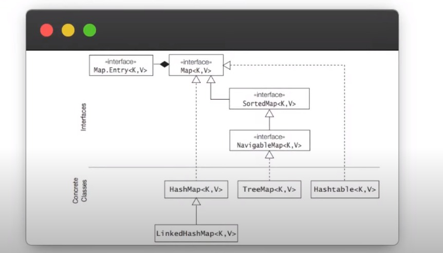

<h4 style="color: red;">Disclaimer: All Codes and Notes have been directly or indirectly inspired from this Riddhi Dutta
Video. The codes have been written by mine but the screenshots have been taken from his video.</h4>
[Link to the Video](https://www.youtube.com/watch?v=VE_AAUxTUCY)

<h3>Collections Implementation Flowchart</h3>

<h4>ArrayList vs LinkedList</h4>

> ArrayList -> Position Based Access in O(1) or constant time.
>
> LinkedList -> Position Based Access in O(N) or linear time.

> ArrayList -> Insertion and Deletions in O(N) time.
>
> LinkedList -> Insertion and Deletions in O(1) time.

<h4>Sublists</h4>
> Sublist creates a shallow copy of the original list and hence changes made to a sublist will affect the original list
> as well.
>
> Subists should be used as a view copy mainly.

<h4>next() vs previous()</h4>
> next() is a postfix operation. The iterator first accesses the position and then moves the pointer forward.
>
> previous() is a prefix operation. The iterator first moves the pointer backward and then accesses the data.

<h4>Usage of Stack and Queue and Deque</h4>
> When implementing Stack, use Stack<>.
>
> When implementing Queue, use LinkedList<>.
>
> When implementing Deque, use ArrayDeque<>.